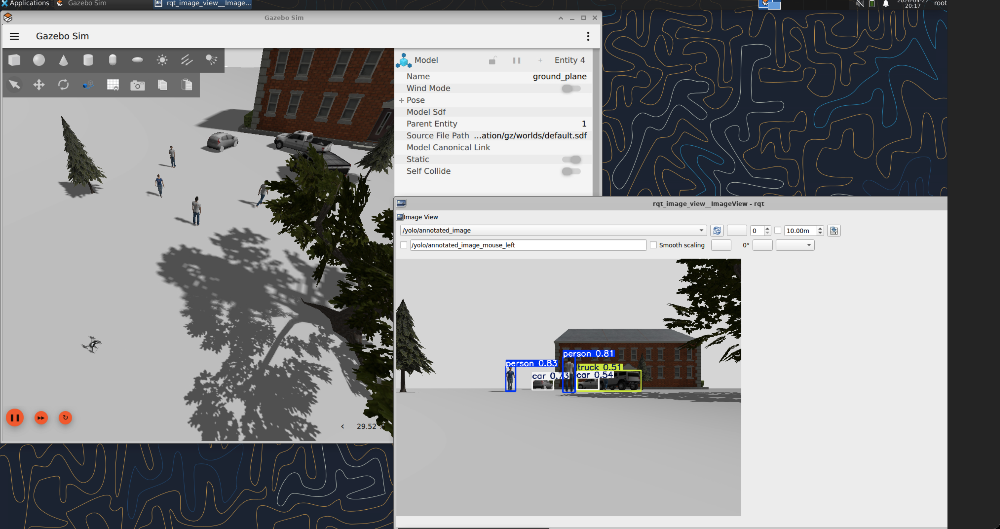

# px4-perception-ros2

Real-time YOLOv8 object detection on a simulated drone's forward-facing
camera, running end-to-end on PX4 SITL + Gazebo Harmonic + ROS2 Jazzy
inside a GPU-enabled Docker container.

The pipeline subscribes to the quadcopter's onboard camera, runs YOLOv8
inference on every frame, and publishes both a structured detection list
(custom ROS2 message) and an annotated image stream that can be inspected
live in `rqt_image_view`.

---

## Demo



*Detections in a single frame from the simulated `x500_mono_cam`
quadcopter: two persons, two cars, and one truck, with class labels and
confidence scores rendered on top of the published `/yolo/annotated_image`
topic.*

---

## Architecture

```
                       Gazebo Harmonic (PX4 SITL)
                       ┌──────────────────────────┐
                       │  x500_mono_cam airframe  │
                       │  └─ camera sensor ───────┼──► gz topic
                       └──────────────────────────┘     /world/default/.../image
                                                              │
                                                              ▼
                                              ┌─────────────────────────────┐
                                              │  ros_gz_image_bridge        │
                                              │  (gz.msgs.Image → ROS2)     │
                                              └─────────────────────────────┘
                                                              │
                                                              ▼ sensor_msgs/Image
                                              ┌─────────────────────────────┐
                                              │  yolo_detector node         │
                                              │  ───────────────────────    │
                                              │  • cv_bridge → numpy BGR    │
                                              │  • YOLOv8n on CUDA          │
                                              │  • box / class / conf       │
                                              │  • latency + FPS tracking   │
                                              └─────────────────────────────┘
                                                   │                    │
                          perception_msgs/         │                    │  sensor_msgs/Image
                          DetectionArray           ▼                    ▼
                                       /yolo/detections      /yolo/annotated_image
                                                                          │
                                                                          ▼
                                                                  rqt_image_view
```
---

## Features

- **Real-time YOLOv8 inference** — ~12 ms latency, ~80 FPS on an NVIDIA H100
  with the `yolov8n` weights.
- **Custom ROS2 messages** — `perception_msgs/Detection` and
  `perception_msgs/DetectionArray` carry bounding boxes, COCO class IDs,
  confidence scores, and per-frame inference latency.
- **Configurable confidence threshold** exposed as a ROS2 parameter
  (`confidence_threshold`).
- **Performance metrics** logged every 30 frames (rolling-window mean
  latency + FPS + detection count).
- **Reproducible scene generation** via `scripts/spawn_objects.sh` —
  injects a fixed set of COCO-class entities into the running Gazebo world
  so detections are deterministic across runs.
- **GPU-ready Docker image** that extends the upstream `px4-sim` base with
  torch, torchvision, and ultralytics pre-installed.

---

## Prerequisites

- **Docker**
- **NVIDIA GPU + driver + NVIDIA Container Toolkit**

 The
noVNC entry point exposed by the px4-sim base image at port `6080` makes
the Gazebo and rqt windows usable inside an ordinary browser tab.

---

## Setup

Four shell commands. Clone both repos as siblings, symlink the Compose
override, bring the container up, and build the ROS2 workspace inside it:

```bash
# 1. Clone both repos as siblings (any parent directory works).
mkdir -p ~/project && cd ~/project
git clone https://github.com/rkaushik97/px4-perception-ros2.git
git clone https://github.com/erdemuysalx/px4-sim.git

# 2. Layer this repo's GPU + bind-mount config onto px4-sim's compose file.
cd ~/project/px4-sim
ln -s ../px4-perception-ros2/docker/docker-compose.override.yml .

# 3. Build the upstream image, then build + start ours.
#    First run pulls the base image and installs torch + ultralytics + numpy<2;

./build.sh --all
docker compose up -d

# 4. Build the ROS2 workspace inside the container (~6 s).
docker exec -it px4_sitl bash -lc \
  'source /opt/ros/jazzy/setup.bash && cd /root/px4-perception-ros2/ros2_ws && colcon build'
```
---

## Running the pipeline

The pipeline runs across five terminals, each opened with
`docker exec -it px4_sitl bash`. Open them in this order — components
later in the list assume earlier ones are alive.

**Terminal 1 — PX4 SITL + Gazebo**

```bash
cd /root/PX4-Autopilot
make px4_sitl gz_x500_mono_cam
```

```text
INFO  [init] found model autostart file as SYS_AUTOSTART=4010
INFO  [init] Gazebo simulator 8.11.0
INFO  [init] Starting gazebo with world: .../default.sdf
INFO  [init] Waiting for Gazebo world...
INFO  [init] Gazebo world is ready
INFO  [init] Spawning Gazebo model
...
pxh>
```

**Terminal 2 — Gazebo → ROS2 image bridge**

```bash
ros2 run ros_gz_image image_bridge \
  /world/default/model/x500_mono_cam_0/link/camera_link/sensor/camera/image
```

**Terminal 3 — YOLO detector node**

```bash
/root/px4-perception-ros2/scripts/run_yolo.sh
# or, with a different model:
/root/px4-perception-ros2/scripts/run_yolo.sh --model yolov8s.pt
```

`run_yolo.sh` sources the ROS env, sanity-checks the workspace + PX4,
verifies that torch / ultralytics / cv_bridge import, then launches the
detector with the system `python3` (the Dockerfile installs all deps
system-wide — no venv anywhere). First-time runs auto-download
`yolov8n.pt` (~6 MB).

```text
Launching yolo_detector with /usr/bin/python3
[INFO] [yolo_detector]: Loading YOLO model: yolov8n.pt on cuda:0
[INFO] [yolo_detector]: Model loaded successfully
[INFO] [yolo_detector]: Subscribed to: /world/default/.../camera/image
[INFO] [yolo_detector]: YOLO detector node ready
[INFO] [yolo_detector]: Frames: 30  | Latency: 28.4 ms | FPS: 35.2 | Detections this frame: 0
[INFO] [yolo_detector]: Frames: 120 | Latency: 11.5 ms | FPS: 87.2 | Detections this frame: 0
...
[INFO] [yolo_detector]: Frames: 600 | Latency: 12.5 ms | FPS: 80.0 | Detections this frame: 5
```

`Detections this frame: 0` until you spawn objects (next step). Latency
converges to ~12 ms on H100 after warmup.

**Terminal 4 — Spawn objects into the world**

```bash
/root/px4-perception-ros2/scripts/spawn_objects.sh
```

Injects four people, two cars, one truck, plus buildings and trees via
`gz service` calls. First spawn waits a few extra seconds for Gazebo to
download the Fuel models.

```text
Spawning person1...
data: true
Spawning person2...
data: true
...
Spawn complete. populated 12 entities into /world/default.

Next: in another terminal, view detections with
  ros2 run rqt_image_view rqt_image_view
and select /yolo/annotated_image from the topic dropdown.
```

Once the models render, Terminal 3 should jump from `Detections this
frame: 0` to `Detections this frame: 5`.

**Terminal 5 — Visualization**

```bash
ros2 run rqt_image_view rqt_image_view /yolo/annotated_image
```

Passing the topic as a positional argument pre-selects it — no need to
fish through the dropdown. The annotated camera feed (boxes + class
labels + confidence scores) appears in the noVNC desktop.

To inspect the structured detection list from yet another terminal:

```bash
ros2 topic echo --once /yolo/detections
```

```text
header: { frame_id: camera_link, ... }
detections:
- bbox_x: 406.06,  bbox_y: 399.60,  bbox_width: 36.60, bbox_height: 91.54
  class_name: person, class_id: 0, confidence: 0.83
- bbox_x: 618.61,  bbox_y: 363.30,  bbox_width: 44.55, bbox_height: 132.40
  class_name: person, class_id: 0, confidence: 0.81
- ... (5 detections per frame in the canonical scene)
inference_latency_ms: 12.4
image_width:  640.0
image_height: 480.0
```

---

## Custom messages

The assignment requires a custom message type for detection results. The
`perception_msgs` package defines two:

`msg/Detection.msg`

```
# A single 2D object detection.

std_msgs/Header header

# Bounding box (image coordinates, pixels)
float64 bbox_x       # top-left x
float64 bbox_y       # top-left y
float64 bbox_width
float64 bbox_height

# Classification
string class_name    # e.g. "person", "car"
int32 class_id       # COCO class id (0 = person, 2 = car, ...)
float32 confidence   # [0.0, 1.0]
```

`msg/DetectionArray.msg`

```
# Array of detections from a single image frame.

std_msgs/Header header
Detection[] detections

# Performance metadata (this frame only)
float32 inference_latency_ms
float32 image_width
float32 image_height
```
---

## Performance

Latency and FPS measured on a single NVIDIA H100, 640×480 input, default
confidence threshold 0.50.

| Model      | Mean latency (ms) | FPS   | Detections/frame |
|------------|-------------------|-------|------------------|
| `yolov8n`  | ~12               | ~80   | 5                |
| `yolov8s`  | _TBD_             | _TBD_ | _TBD_            |
| `yolov8m`  | _TBD_             | _TBD_ | _TBD_            |

The `yolo_detector` node logs `mean latency (ms) | FPS | detections` every
30 frames so the numbers above can be reproduced by tailing Terminal 3.

---

## Repository structure

```
px4-perception-ros2/
├── README.md
├── requirements.txt
├── docker/
│   ├── Dockerfile                   # extends erdemuysalx/px4-sitl with torch/ultralytics
│   └── docker-compose.override.yml  # GPU + bind-mount layer for px4-sim's compose
├── media/
│   └── yolo_perception_demo.png
├── ros2_ws/
│   └── src/
│       ├── perception_msgs/         # ament_cmake — custom message package
│       │   ├── CMakeLists.txt
│       │   ├── package.xml
│       │   └── msg/
│       │       ├── Detection.msg
│       │       └── DetectionArray.msg
│       └── yolo_detector/           # ament_python — YOLO node
│           ├── package.xml
│           ├── setup.py
│           └── yolo_detector/detector_node.py
├── scripts/
│   ├── run_yolo.sh                  # launcher with sanity checks + --model flag
│   └── spawn_objects.sh             # populates Gazebo with COCO objects
└── worlds/
    └── perception_world.sdf
```

---

## Implementation notes

These are the non-obvious things that bit during development. The
Dockerfile and run scripts already handle them — they're documented here
so anyone reproducing the build understands *why*.

1. **`numpy<2` is mandatory.** ROS2 Jazzy's `cv_bridge` is built against
   the numpy 1.x ABI and segfaults on import under numpy 2.x. ultralytics
   resolves numpy 2.x by default, so the Dockerfile pins `numpy<2` in the
   same `pip install` as ultralytics — and uses `--ignore-installed numpy`
   so pip doesn't try to uninstall the debian-managed numpy (no RECORD
   file, can't be removed).
2. **Custom messages must live in `ament_cmake`.** rosidl does not
   support a Python-only build path. The two-package split is not
   stylistic — it's the only way `.msg` generation works.
3. **Don't put Fuel-model `<include>` blocks in the world SDF.** Gazebo
   blocks the world from coming up while it downloads them, which causes
   PX4 to time out and abort the launch. Spawn the entities at runtime
   via `gz service` calls (`spawn_objects.sh`) instead.
4. **NVIDIA Container Toolkit must be on the host.** The `runtime:
   nvidia` block is silently ignored if the toolkit isn't installed; the
   symptom is torch falling back to CPU and inference running 50× slower.
5. **Files written inside the container are root-owned on the host.**
   The bind-mount preserves uid/gid, and the container runs as `root`.
   If you build the workspace inside the container and then commit from
   the host, fix ownership first:

   ```bash
   sudo chown -R $USER:$USER ~/project/px4-perception-ros2
   ```

---

## Future work

- **Aufgabe 2 — depth estimation + 3D point cloud.** Run a monocular
  depth model on the same image stream, fuse with the YOLO detections,
  and publish a sparse point cloud of detected objects in the camera
  frame.
- **Real offboard flight.** Arm the vehicle, switch to OFFBOARD mode, and
  stream `TrajectorySetpoint` messages over `/fmu/in/...` so the drone
  flies the test path under PX4's control rather than via simulator pose
  teleports.
- **Real-world deployment.** The detector is camera-agnostic — pointing
  it at a real `usb_cam` or RTSP stream is one parameter change away.

---

## Acknowledgements

- **px4-sim** by [@erdemuysalx](https://github.com/erdemuysalx) — the
  Docker base image (ROS2 Jazzy + Gazebo Harmonic + PX4 SITL + noVNC)
  this project builds on.
- **ultralytics** for the YOLOv8 implementation and pretrained COCO
  weights.
- **Open Robotics / Gazebo Fuel** for the human and vehicle models used
  in the test scene.

---

## License

Apache License 2.0. See `LICENSE` files in the individual ROS2 packages.
